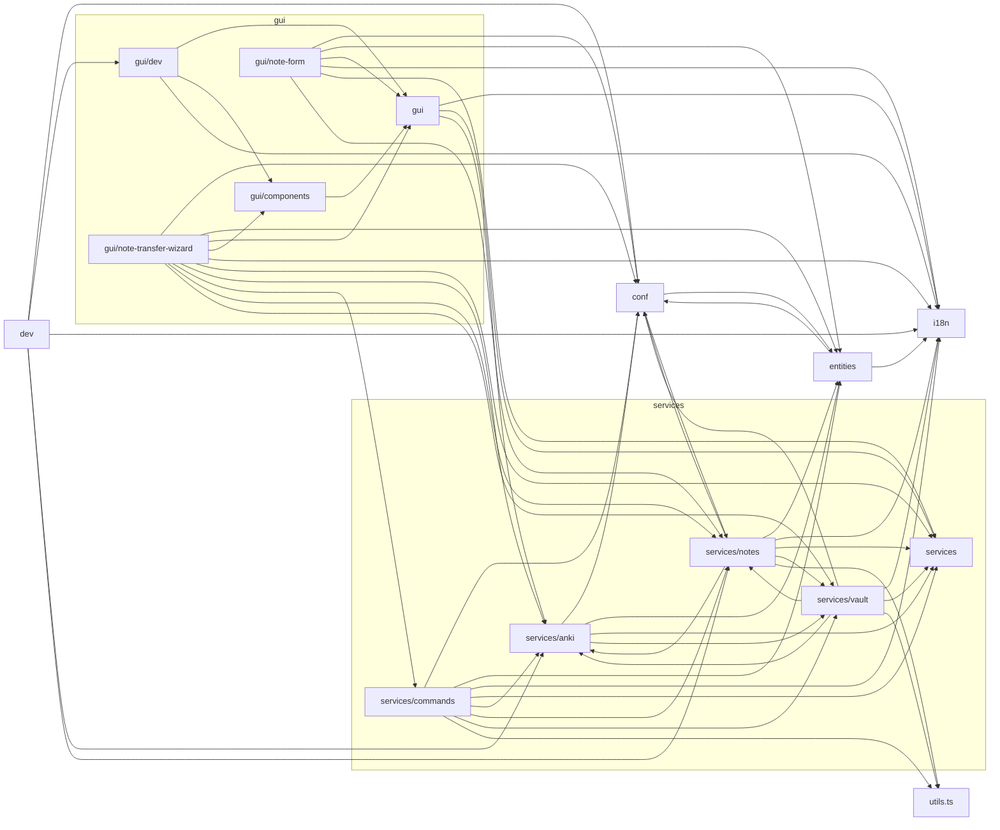

# Architecture

> This document is generated from source code. Do not edit manually.
> Run `pnpm run depcruise:graph` to regenerate.

```mermaid
flowchart LR
  subgraph gui_area["gui"]
    gui["gui"]
    gui_components["gui/components"]
    gui_dev["gui/dev"]
    gui_note_form["gui/note-form"]
    gui_note_transfer_wizard["gui/note-transfer-wizard"]
  end
  subgraph services_area["services"]
    services["services"]
    services_anki["services/anki"]
    services_commands["services/commands"]
    services_notes["services/notes"]
    services_vault["services/vault"]
  end
  conf["conf"]
  dev["dev"]
  entities["entities"]
  i18n["i18n"]
  utils_ts["utils.ts"]
  conf --> entities
  conf --> services_notes
  dev --> conf
  dev --> gui_dev
  dev --> i18n
  dev --> services_anki
  dev --> services_notes
  entities --> conf
  entities --> i18n
  gui --> i18n
  gui --> services
  gui --> services_anki
  gui_components --> gui
  gui_dev --> gui
  gui_dev --> gui_components
  gui_dev --> i18n
  gui_note_form --> conf
  gui_note_form --> entities
  gui_note_form --> gui
  gui_note_form --> i18n
  gui_note_form --> services
  gui_note_form --> services_notes
  gui_note_transfer_wizard --> conf
  gui_note_transfer_wizard --> entities
  gui_note_transfer_wizard --> gui
  gui_note_transfer_wizard --> gui_components
  gui_note_transfer_wizard --> i18n
  gui_note_transfer_wizard --> services
  gui_note_transfer_wizard --> services_anki
  gui_note_transfer_wizard --> services_commands
  gui_note_transfer_wizard --> services_notes
  gui_note_transfer_wizard --> services_vault
  services_anki --> conf
  services_anki --> entities
  services_anki --> services
  services_anki --> services_vault
  services_commands --> conf
  services_commands --> entities
  services_commands --> i18n
  services_commands --> services
  services_commands --> services_anki
  services_commands --> services_notes
  services_commands --> services_vault
  services_commands --> utils_ts
  services_notes --> conf
  services_notes --> entities
  services_notes --> i18n
  services_notes --> services
  services_notes --> services_anki
  services_notes --> services_vault
  services_notes --> utils_ts
  services_vault --> conf
  services_vault --> i18n
  services_vault --> services
  services_vault --> services_anki
  services_vault --> services_notes
  services_vault --> utils_ts
```
